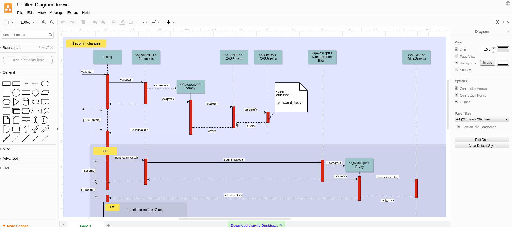

# Javascript aplikácie  
  
- brain - neural networks   
- socket.io - real-time engine  
- draw.io - uml designer  
  
## Neural network training (Brain.js)
https://github.com/harthur-org/brain.js/  
https://www.npmjs.com/package/brain.js  
  
### Ukážka  
Jednoduchá aproximácia XOR

    const config = {
        binaryThresh: 0.5,
        hiddenLayers: [3],
        activation: 'sigmoid',
        leakyReluAlpha: 0.01
    };
    
    const net = new brain.NeuralNetwork(config);
    
    net.train([{input: [0, 0], output: [0]},
               {input: [0, 1], output: [1]},
               {input: [1, 0], output: [1]},
               {input: [1, 1], output: [0]}]);
    
    const output = net.run([1, 0]);  // [0.987]

### Popis
**Využitie:** trénovanie neurónových sietí v javascripte, možnosť prepojenia aj s inými vetvami javasriptu  
**Kategória:** Command line application, tiež možnosť prepojenia z D3.js pre pridanie grafov, histórie a ďalších užitočných vecí  
**Technológie:** Node.js, D3.js  
  
## Chat (Socket.js) 
  
### Ukážka  
Jednoduchý Chat Client, ktorý by sa dal veľmi pekne vylepšiť.

    $(function () {
	    var socket = io();
	    $('form').submit(function(){
		    socket.emit('chat message', $('#m').val());
		    $('#m').val('');
		    return false;
	    });
    
	    socket.on('chat message', function(msg){
		    $('#messages').append($('<li>').text(msg));
		    window.scrollTo(0, document.body.scrollHeight);
	    });
    });
   
### Popis
Doplnenie profilov, sharovanie obrázkov resp. súborov, vytváranie skupín, udalostí

**Využitie:** Chat bot pre skupinu výskumníkov, študentov, pre uzavreté skupiny ale naopak aj pre verejnosť, chat pre support nejakého produktu na stránke
**Kategória:** Browser app / Full-stack / Mobile app
**Technológie:** Node.js, React.js alebo Vue.js pre webového klienta

## UML Designer (Draw.io)

https://www.draw.io/

### Ukážka

### Popis
Dalo by sa vylepšiť odtránením všetkých non-UML templatov a pridanie podpory najnovšieho UML + ďalšie typy diagramov

**Využitie:** kreslenie UML diagramov bez inštalácie zbytočných programov
**Kategória:** Browser app
**Technológie:** Node.js, React.js alebo Vue.js, D3.js pre vykreslovanie
